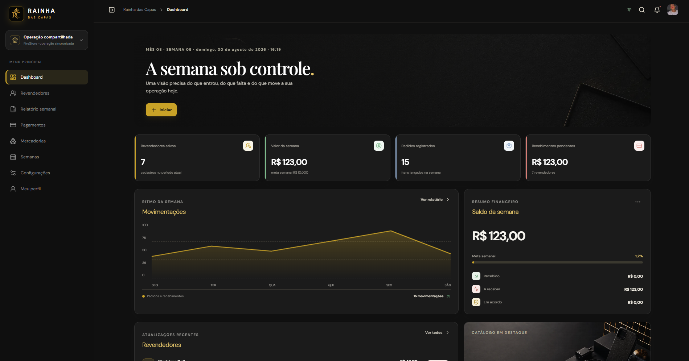
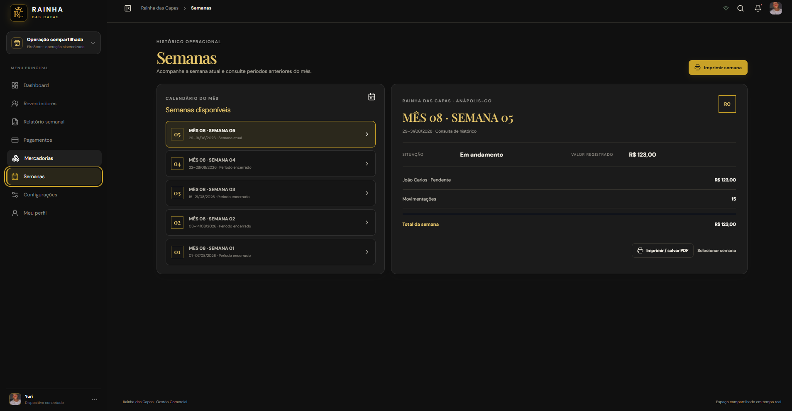
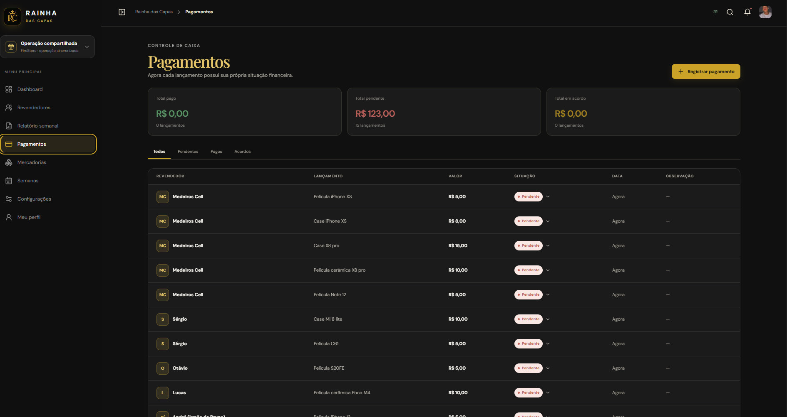

# Rainha das Capas — Gestão Comercial

Sistema web de gestão comercial desenvolvido para centralizar a operação da Rainha das Capas, com controle de revendedores, mercadorias, pagamentos, períodos semanais, relatórios e catálogo.

A aplicação foi estruturada como uma plataforma administrativa responsiva, com interface orientada a operações comerciais e sincronização de dados em tempo real.

## Preview

### Dashboard



### Controle semanal



### Pagamentos



## Sobre o projeto

O sistema foi desenvolvido para substituir controles descentralizados por uma interface única de operação.

A aplicação permite acompanhar o fluxo comercial através de um dashboard, registrar movimentações, acompanhar valores pendentes, consultar períodos anteriores e administrar informações relacionadas aos revendedores e mercadorias.

O projeto utiliza uma arquitetura moderna baseada em React, TypeScript, Vite e Firebase, com recursos adicionais para PWA, persistência e sincronização em tempo real.

## Principais módulos

### Dashboard

Painel principal para acompanhamento da operação atual.

Exibe indicadores como:

- Revendedores ativos
- Valor movimentado na semana
- Pedidos registrados
- Recebimentos pendentes
- Movimentações da semana
- Saldo financeiro
- Meta semanal
- Atualizações recentes
- Catálogo em destaque

### Revendedores

Área destinada ao gerenciamento dos revendedores cadastrados e suas movimentações comerciais.

### Relatório semanal

Consolidação das operações realizadas durante o período semanal, permitindo acompanhar valores e movimentações.

### Pagamentos

Módulo para controle financeiro dos lançamentos.

Possibilita separar os registros por situação:

- Todos
- Pendentes
- Pagos
- Acordos

Também apresenta os totais financeiros correspondentes a cada situação.

### Mercadorias

Área dedicada ao gerenciamento dos itens comercializados e suas respectivas movimentações.

### Semanas

Controle histórico dos períodos operacionais.

A aplicação permite selecionar semanas anteriores, consultar os valores registrados e visualizar os lançamentos correspondentes.

Também existe suporte para impressão e geração de documentos a partir dos relatórios.

### Configurações

Centraliza configurações da aplicação, incluindo preferências de interface, comportamento do PWA e opções relacionadas à operação.

### Meu perfil

Área destinada às configurações do usuário e personalização do perfil.

## Arquitetura

O projeto utiliza uma arquitetura dividida em camadas de interface, lógica compartilhada, servidor e persistência.

```text
Rainhadascapas/
├── client/
│   └── aplicação React
├── server/
│   └── serviços e integração da aplicação
├── shared/
│   └── estruturas compartilhadas
├── drizzle/
│   └── configuração relacionada ao banco
├── docs/
│   └── documentação
├── tools/
│   └── ferramentas auxiliares
├── patches/
│   └── patches de dependências
├── .github/
│   └── workflows de CI/CD
├── firebase.json
├── firestore.rules
├── package.json
├── tsconfig.json
├── vite.config.ts
└── vitest.config.ts
```

## Stack

### Frontend

- React 19
- TypeScript
- Vite
- Tailwind CSS
- Radix UI
- React Hook Form
- TanStack React Query
- Wouter
- Framer Motion
- Recharts
- Lucide React

### Backend e serviços

- Node.js
- Express
- Firebase
- Cloud Firestore
- Firebase Authentication
- Drizzle ORM
- MySQL
- AWS S3

### Qualidade e desenvolvimento

- TypeScript
- Vitest
- Prettier
- ESLint
- pnpm
- esbuild

## Firebase e sincronização

A aplicação utiliza o Firebase para recursos de autenticação e persistência compartilhada.

O Firestore é utilizado para sincronização em tempo real dos dados da operação.

O projeto utiliza listeners do Firestore para refletir alterações entre dispositivos conectados ao mesmo workspace.

A autenticação técnica da aplicação utiliza Firebase Anonymous Authentication, evitando uma tela de login convencional no fluxo operacional atual.

## PWA

O projeto possui suporte a Progressive Web App.

Entre os recursos implementados estão:

- Manifest
- Service Worker
- Instalação como aplicativo
- Atualização do aplicativo
- Cache local
- Operação com recursos offline
- Reidratação dos dados após reconexão

## Responsividade

A interface foi desenvolvida para utilização em diferentes resoluções, mantendo o foco em operações administrativas.

O layout utiliza:

- Menu lateral
- Dashboard modular
- Cards de indicadores
- Tabelas de dados
- Painéis financeiros
- Gráficos
- Controles adaptativos

## Design System

A interface segue uma identidade visual denominada Black Label ERP.

Características principais:

- Fundo escuro
- Superfícies em grafite
- Acentos dourados
- Contraste elevado
- Componentes modulares
- Tipografia editorial
- Estados visuais para operações financeiras
- Modo claro e escuro
- Microinterações
- Layout administrativo responsivo

## Dados e segurança

O projeto utiliza regras do Cloud Firestore para limitar o acesso aos documentos armazenados.

A configuração atual utiliza autenticação anônima para identificar tecnicamente cada dispositivo e regras específicas para o workspace compartilhado.

Informações sensíveis e credenciais privadas não devem ser armazenadas diretamente no código-fonte.

As variáveis de configuração do Firebase são fornecidas através do ambiente de build.

## Desenvolvimento local

Requisitos:

- Node.js 22 ou superior
- pnpm

Instalação:

```bash
pnpm install
```

Verificação de tipos:

```bash
pnpm exec tsc --noEmit
```

Testes:

```bash
pnpm test
```

Build:

```bash
pnpm run build
```

Servidor de desenvolvimento:

```bash
pnpm dev
```

## Scripts

| Comando | Função |
|---|---|
| `pnpm dev` | Inicia o ambiente de desenvolvimento |
| `pnpm run build` | Gera o build de produção |
| `pnpm start` | Executa a aplicação em produção |
| `pnpm exec tsc --noEmit` | Executa verificação de tipos |
| `pnpm test` | Executa os testes |
| `pnpm format` | Formata os arquivos |
| `pnpm db:push` | Gera e aplica alterações relacionadas ao banco |

## Deploy

A aplicação possui configuração para publicação através do GitHub Pages e GitHub Actions.

O processo de publicação executa o build e disponibiliza os arquivos gerados no ambiente de Pages.

A aplicação também utiliza `import.meta.env.BASE_URL` para resolver corretamente os caminhos quando publicada em um subdiretório.

## Estado atual do projeto

O sistema está estruturado como uma aplicação de gestão comercial de uso operacional, com recursos de:

- Gestão de revendedores
- Gestão de mercadorias
- Controle financeiro
- Relatórios semanais
- Histórico operacional
- Sincronização em tempo real
- PWA
- Persistência de dados
- Perfil de usuário
- Configurações
- Interface responsiva

## Código-fonte

Este projeto é apresentado publicamente como portfólio e demonstração visual.

O código-fonte completo e a infraestrutura operacional podem permanecer em um repositório privado quando o sistema for utilizado em ambiente comercial.

## Autor

**Yuri**

Desenvolvedor Full Stack

GitHub: https://github.com/Yurihbo
